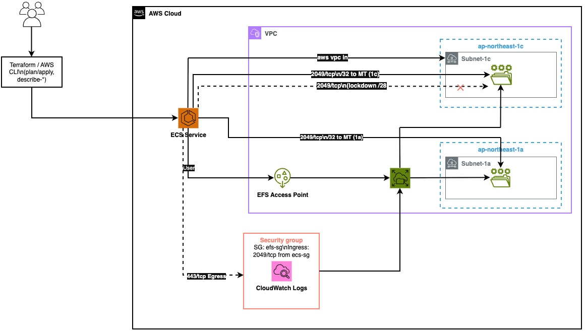

# ECS 検証（最小構成での失敗再現と改善）

## 概要

- 職場で「コンテナ実行時に SG の片方向のみ疎通（NFS 2049/TCP）を許可しておらず、コンテナが起動しない」事象が発生。これを個人環境で再現し、/32×MT への改善で解消できることを検証。
- タスク1: 片側AZのみ許可＋未許可AZで Fargate を起動し、EFS マウント失敗を再現（code:32 等）。
- タスク2: ECS SG の 2049/TCP を EFS マウントターゲット実IP(/32) に置換し、タスク RUNNING まで到達することを確認。

## 構成図



## ディレクトリ構造（抜粋）

```bash
project/ecs-validate/
├─ infra/                  # Terraform ルート
│  ├─ main.tf
│  ├─ variables.tf, outputs.tf, providers.tf, versions.tf, locals.tf
│  ├─ envs/dev.tfvars
│  └─ modules/
│     ├─ network/  ├─ security/ ├─ efs/ ├─ ecs/{cluster,task_definition,service}/
│     ├─ iam/      └─ logs/
├─ docs/                   # 詳細ドキュメント（コスト/手順/FAQなど）
└─ issues/                 # 検証ログ（コマンドと実行結果）
```

## ドキュメント

- 詳細は `docs/` に分離しました（コスト、段階適用、トラブルシューティング、コマンド集など）。
- 検証時の実コマンドと出力は `issues/` に時系列で保存しています。

リンク集（主要ドキュメント）

- [docs/index.md](docs/index.md) — 目次
- [docs/deploy-phases.md](docs/deploy-phases.md) — 段階適用: enable_iam → logs → efs → security → ecs
- [docs/ecs-efs-failure-repro.md](docs/ecs-efs-failure-repro.md) — タスク1: 失敗再現
- [docs/ecs-efs-fix-mt-32.md](docs/ecs-efs-fix-mt-32.md) — タスク2: /32×MT で成功
- [docs/troubleshooting.md](docs/troubleshooting.md) — 代表的なエラーと切り分け
- [docs/cost.md](docs/cost.md) — 最小コスト運用の指針

検証ログ（issues）

- [issues/](issues/) — すべての検証ログ
- [issues/2026-01-11-ecs-efs-repro.md](issues/2026-01-11-ecs-efs-repro.md) — ECS×EFS 失敗再現 → /32 化までの実行ログ

ユーザーポータル URL は、AWS マネジメントコンソール → IAM Identity Center → 設定 → AWS アクセスポータル で確認できます。

### コンソール（ブラウザ）でのログイン

1. ユーザーポータル URL にアクセスします。
2. 表示に従ってサインインします（外部 IdP 利用時は自動リダイレクト）。
3. サインイン後、「AWS アカウント」から対象アカウント/ロールの「Management console」をクリックすると、AWS コンソールへ遷移します。

### CLI（AWS CLI v2）でのログイン

初回設定（プロファイル作成）

```bash
aws configure sso
# プロンプト例：
# SSO session name (Recommended): <任意の名前>
# SSO start URL [None]: https://<alias or d-xxxxxxxxxx>.awsapps.com/start
# SSO region [None]: ap-northeast-1   # 例（実環境に合わせて入力）
# CLI default client Region [None]: ap-northeast-1
# CLI default output format [None]: json
# 登録されたアカウント/ロールから対象を選択 → プロファイル名を入力
```

ログイン実行と確認

```bash
aws sso login --profile <profile-name>
aws sts get-caller-identity --profile <profile-name>
```

以後、毎回 `--profile` を付与するか、環境変数で固定します。

```bash
export AWS_PROFILE=<profile-name>
export AWS_REGION=ap-northeast-1   # 例：東京リージョン
aws sts get-caller-identity
```

セッションが切れた場合の再ログイン

```bash
aws sso login --profile <profile-name>
```

### Terraform での利用（例）

このリポジトリの `infra/` を適用する際は、上記の CLI ログインを済ませた上で、`AWS_PROFILE` を指定して実行します。

```bash
cd infra
export AWS_PROFILE=<profile-name>
export AWS_REGION=ap-northeast-1               # 例
terraform init -upgrade
terraform plan  -var-file=envs/dev.tfvars
terraform apply -var-file=envs/dev.tfvars
```

### よくあるエラーと対処

- `The SSO session associated with this profile has expired` などの期限切れ:
  - `aws sso login --profile <profile-name>` を再実行。
- `SSO session not found` やプロファイル解決失敗:
  - `~/.aws/config` の該当プロファイルに `sso_start_url`/`sso_region`/`sso_account_id`/`sso_role_name`（または `sso_session` 参照）があるか確認。なければ `aws configure sso` で作成し直し。
- リージョン未指定エラー:
  - `--region` を付与、または `AWS_REGION`/`AWS_DEFAULT_REGION` をエクスポート。

### メモ（ブラウザで見た完了メッセージ）

CLI ログインフロー中にブラウザで以下のメッセージが表示されたら、認証情報の共有は成功しています。そのタブは閉じて問題ありません。
